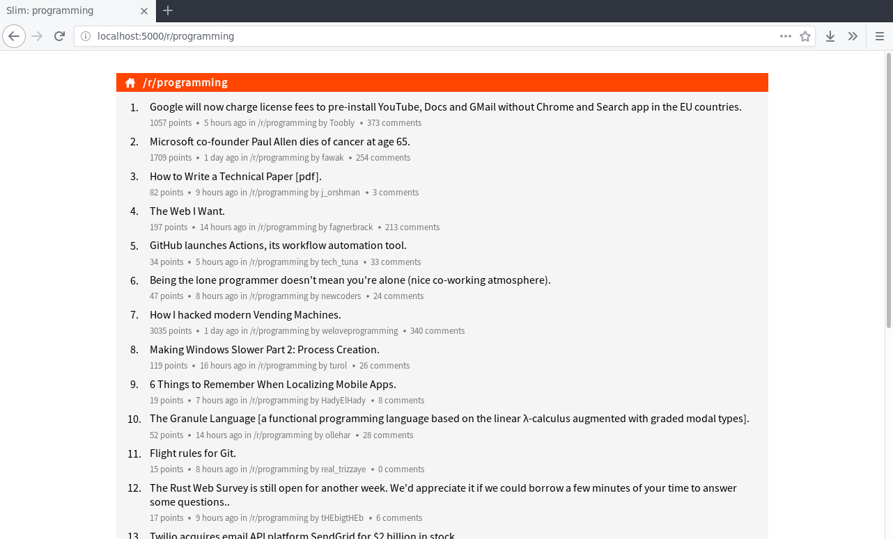

# Slim for Reddit

A lightweight read-only Reddit client written in Python using the Flask framework.




## Features

- View front page and subreddit pages
- View comment threads
- View user profiles, including submissions and comments
- Flair and OP-highlighting support


## Dependencies

- Flask
- Python 3 modules:
  - markdown2 (https://github.com/trentm/python-markdown2)


## Installation and use

- Install Flask and markdown2
  - Using pip:
    
    ```
    pip3 install flask
    pip3 install markdown2
    ```

- Clone the contents of this Git repository to a directory of your choice
  - E.g.:

    ```
    cd some/directory/
    git clone https://github.com/cjlh/slim-for-reddit.git .
    ```
- Run Flask using `application.py`:
  - E.g. using the Flask server:

    ```export FLASK_APP=application.py; flask run```

- Open your web browser and visit the URL printed in the terminal (default: http://127.0.0.1:5000/)


## License

This software is published under the MIT license. See the [LICENSE](LICENSE) file for more information.

